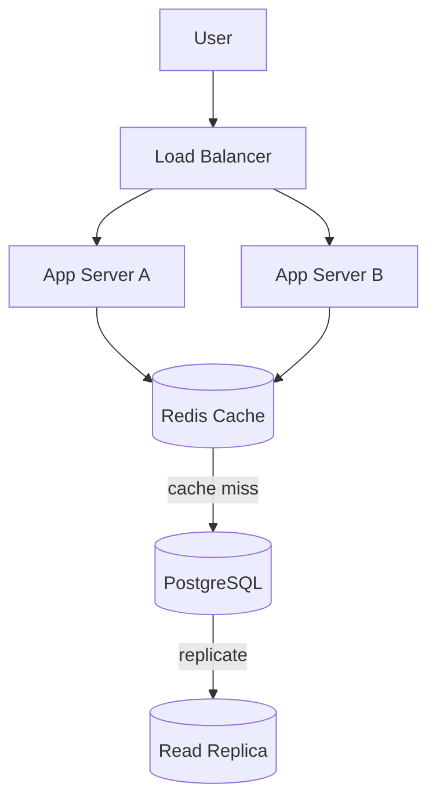
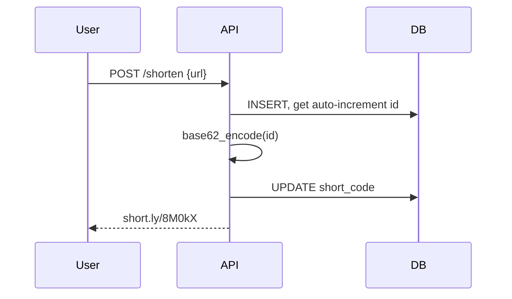
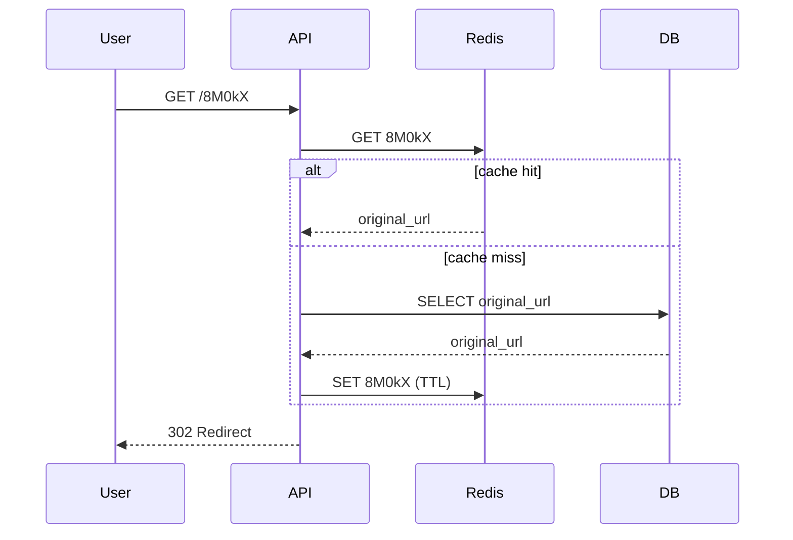

Today I learned the fundamentals of System Design by designing a simplified URL Shortener similar to Bitly. I explored how requests flow through a system, how databases store mappings, and how scalability can be improved using caching and load balancing.

## Problem Statement

Build a service that:

- Accepts a long URL and returns a short one
- Redirects a short URL to its original destination
- Handles **millions of writes and billions of reads**
- Keeps redirect latency low (<50ms p99)

```
Input:  https://www.example.com/blog/system-design-fundamentals
Output: https://short.ly/a1B2c3
```

## Requirements

**Functional**
- Shorten a long URL into a unique code
- Redirect short → original in one hop
- Support optional custom aliases (`short.ly/aman-resume`)
- Optional expiry per link

**Non-functional**
- Read-heavy: reads ≫ writes (~100:1 in most real systems)
- Low-latency redirects
- High availability (redirects should survive a DB outage)
- Short codes must be globally unique, no collisions

## Capacity Estimation (the part most tutorials skip)

Assume 100M new URLs/month:

```
Writes/sec  = 100,000,000 / (30 * 24 * 3600) ≈ 39 writes/sec
Reads/sec   = 100:1 read:write ratio ≈ 3,900 reads/sec
Storage/yr  = 100M * 12 * ~500 bytes/row ≈ 600 GB/year
```

None of this needs a distributed database on day one — it needs a **single well-indexed Postgres instance behind a cache**. The interesting design decisions are in encoding and caching, not sharding, until you're well past this scale.

## High-Level Architecture



## Encoding Strategy: Random Codes vs Base62 Counter

My first draft used `random.choice()` and retried on collision. That works at small scale but has two problems: collision probability grows with table size, and the retry loop adds unbounded latency under load.

A cleaner approach: **auto-increment ID → Base62 encode**.

```
id = 125_000_000
base62(id) = "8M0kX"
```

- Every ID is unique by construction — zero collision checks
- 62^6 ≈ 56.8 billion possible 6-character codes, more than enough
- Encoding/decoding is O(1) and reversible, so no DB lookup is needed to *validate* a code, only to resolve it

Trade-off: sequential IDs make short codes guessable/enumerable. If that matters (private links), XOR or shuffle the ID with a fixed permutation table before encoding, or fall back to a random component for sensitive links.

## Database Design

```sql
CREATE TABLE urls (
    id            BIGSERIAL PRIMARY KEY,
    short_code    VARCHAR(10) UNIQUE NOT NULL,
    original_url  TEXT NOT NULL,
    created_at    TIMESTAMP DEFAULT CURRENT_TIMESTAMP,
    expires_at    TIMESTAMP,
    click_count   BIGINT DEFAULT 0
);

CREATE INDEX idx_short_code ON urls (short_code);
```

`click_count` is denormalized here for read speed; at real scale it moves to an async event stream (Kafka → analytics DB) so hot-path writes never touch the redirect path.

## Request Flow

**Write path**


**Read path**


## Working Python Demonstration

```python
import string

BASE62 = string.digits + string.ascii_lowercase + string.ascii_uppercase

def base62_encode(num: int) -> str:
    if num == 0:
        return BASE62[0]
    digits = []
    while num:
        num, rem = divmod(num, 62)
        digits.append(BASE62[rem])
    return ''.join(reversed(digits))

def base62_decode(code: str) -> int:
    num = 0
    for char in code:
        num = num * 62 + BASE62.index(char)
    return num


class URLShortener:
    def __init__(self):
        self.database = {}   # id -> original_url
        self.next_id = 100_000  # offset so early codes aren't 1-char

    def shorten(self, original_url: str) -> str:
        url_id = self.next_id
        self.next_id += 1
        self.database[url_id] = original_url
        code = base62_encode(url_id)
        return f"https://short.ly/{code}"

    def redirect(self, short_url: str) -> str:
        code = short_url.rstrip('/').split('/')[-1]
        url_id = base62_decode(code)
        return self.database.get(url_id, "URL Not Found")


# Demo
service = URLShortener()
short_url = service.shorten("https://www.example.com/system-design")
print("Generated:", short_url)
print("Redirects To:", service.redirect(short_url))
```

**Output**
```
Generated: https://short.ly/q0U
Redirects To: https://www.example.com/system-design
```

## Scaling the Three Weak Points

**1. Load balancing** — round-robin or least-connections across stateless app servers. Stateless means any server can handle any request, which is what makes horizontal scaling trivial.

**2. Caching** — Redis in front of Postgres, LRU eviction, TTL per entry. Cache the *hot* 20% of URLs that generate 80% of traffic; don't try to cache everything.

**3. Read replicas** — writes go to the primary, redirects (reads) are spread across replicas. Since redirects don't need strong consistency (a few seconds of replication lag is invisible to users), this is a safe place to trade consistency for throughput.

## Failure Modes (what actually gets asked in interviews)

| Failure | Impact | Mitigation |
|---|---|---|
| Redis down | Every request falls through to DB | DB can absorb it short-term; auto-reconnect + circuit breaker on cache client |
| DB primary down | Writes fail, reads still work via replica | Promote replica, or queue writes for retry |
| Hot key (viral link) | One code gets disproportionate traffic | Redis handles this natively (in-memory); consider CDN edge caching for redirect responses |
| ID counter contention | Auto-increment becomes a bottleneck at very high write rates | Switch to a distributed ID generator (Snowflake-style) partitioned by app server |

## What I'd Add for Production

- Rate limiting per API key to prevent abuse of the shorten endpoint
- Malicious URL / phishing check before allowing a shorten
- Custom alias support with a separate uniqueness check (can't base62-derive a custom string)
- Async analytics pipeline instead of synchronous `click_count` updates

## One Thing I Learned

Random-code-with-retry is a prototype pattern, not a system design answer. The moment you can describe *why* an ID-based encoding removes an entire class of collision handling, you've moved from "I built a URL shortener" to "I can reason about a URL shortener at scale" — and that distinction is what the interview is actually testing.
