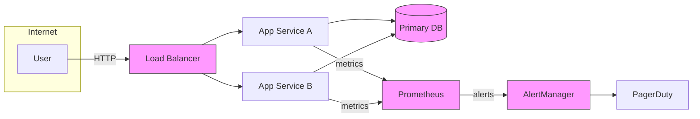
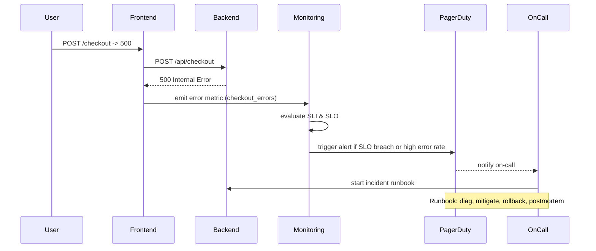

# Day 18 — Visualizing SLOs with Mermaid

Goal

Use Mermaid diagrams to document system architecture, Service Level Objectives (SLOs), and error‑budget burn‑downs. By the end of this post you'll have a set of reusable diagrams (architecture, incident sequence, error‑budget timeline) and a small exercise to apply them to one of your services.

Why this topic

- Mermaid is supported in GitHub markdown, making diagrams visible in PRs, README, and docs without external images.
- SLOs are a practical way to communicate reliability targets and guide operational decisions.
- Combining Mermaid + SLOs helps teams document telemetry points, incident flows, and error‑budget status in a single, versioned place.

Quick primer: Mermaid in GitHub

- GitHub renders Mermaid diagrams in Markdown files and READMEs.
- You can also preview at https://mermaid.live or generate images with mermaid-cli (mmdc).
- Mermaid supports many diagram types: flowchart, sequenceDiagram, gantt, classDiagram, stateDiagram, pie, graph, and more.

SLO, SLI, SLA — short definitions

- SLI (Service Level Indicator): a measurable metric (e.g., request latency p95, successful request ratio).
- SLO (Service Level Objective): target on an SLI (e.g., availability >= 99.9% over 7 days).
- SLA (Service Level Agreement): contractual commitment, often with penalties. SLOs are operational targets; SLAs are legal.

Why visualize SLOs

- Make reliability goals obvious in service docs and runbooks.
- Show where telemetry should be collected and how alerts map to SLO breaches.
- Communicate error‑budget consumption and incident status in on‑call handoffs.

Example diagrams

Below are three practical diagrams you can drop into a markdown file. They render in GitHub.

Architecture diagram (flowchart)



Sequence diagram: incident detection & escalation



Error‑budget burn‑down (simple timeline using gantt)

```mermaid
gantt
  dateFormat  YYYY-MM-DD
  title Error‑budget burn‑down (7‑day window)
  section Week window
  Healthy:    done,  h1, 2026-08-01, 1d
  Small spike: active, s1, 2026-08-02, 1d
  Major incident: crit, i1, 2026-08-03, 1d
  Recovery:    done, r1, 2026-08-04, 1d
  Remaining budget:  remaining, b1, 2026-08-05, 3d
```

Practical walkthrough — build these into service docs

1. Identify SLIs
   - Example SLIs: successful_requests_ratio (successful/total), latency_ms_p95, error_rate_per_min.
   - Choose window length (rolling 7 days / 30 days) that matches operational needs.

2. Set SLOs and compute error budgets
   - Example: Availability SLO = 99.9% over 7 days -> error budget = 0.1% of requests in that period.
   - Calculate allowable downtime or error minutes for the window.

3. Add telemetry points to architecture diagram
   - Mark where metrics are emitted (client, frontend, backend, db) so SLI calculations are unambiguous.
   - Show alerting paths to on‑call tooling.

4. Create an incident sequence diagram and a runbook
   - Sequence diagram highlights who gets called and which components to check first.
   - A runbook (short checklist) attached to the diagram speeds triage.

5. Track error‑budget usage visually
   - Use a simple gantt or bar diagram for documentation snapshots.
   - For live dashboards, generate SVG/PNG from telemetry snapshots (scripted mmdc or dashboard screenshots).

Tooling & automation tips

- Preview & export
  - mermaid.live — quick editing and preview in browser.
  - mermaid-cli (mmdc) — generate PNG/SVG in CI: mmdc -i diagram.mmd -o diagram.svg.

- CI sanity checks
  - Lint Mermaid files (basic checks are community tools) to catch syntax issues before merge.
  - Generate diagrams in CI and commit artifacts (svg) if you need static images for sites that don't render Mermaid.

- Auto‑generate diagrams from telemetry
  - Small scripts can produce Mermaid definitions from monitored metrics (e.g., produce a small gantt for error‑budget remaining).
  - Keep generated diagrams in a /docs/diagrams/ directory and version them alongside runbooks.

Accessibility & maintainability

- Provide alt text and short textual summaries near diagrams for screen readers.
- Keep diagrams simple and focused; break complex systems into multiple diagrams (high level + detailed).
- Use consistent colors/labels across the repo so diagrams are instantly recognizable.

Exercise (apply to one service in this repo)

1. Pick a service or component (e.g., a web frontend or API in this repo).
2. Define 2 SLIs (one availability, one latency) and an SLO for each (7‑day window recommended).
3. Create three Mermaid diagrams: architecture (flowchart), incident sequence, and error‑budget timeline.
4. Commit diagrams and SLO definitions to days/day-18-mermaid-slo.md or to a service README.

Example SLO table (copy into your docs)

| SLI | SLO (7d) | Measurement | Error budget |
|-----|----------|-------------|--------------|
| successful_requests_ratio | >= 99.9% | Prometheus (rate(http_requests_total{code!~"5.."})) | 0.1% of requests |
| p95_latency_ms | <= 300ms | Histogram p95 over 7d | N/A (use as performance SLO) |

Further reading & references

- Google SRE: Service Level Objectives — https://sre.google/sre-book/doing-the-right-thing/
- Mermaid docs: https://mermaid-js.github.io/mermaid/#/
- mermaid-cli: https://github.com/mermaid-js/mermaid-cli

---

If you want, I can:
- Commit this file to the repo now (days/day-18-mermaid-slo.md) — I’m ready to push it.
- Or generate exported SVGs for the diagrams and add them to docs/diagrams/ (useful for static sites that don’t render Mermaid).

Tell me whether to commit as-is or make changes (title style, add more examples, or include a runnable script).